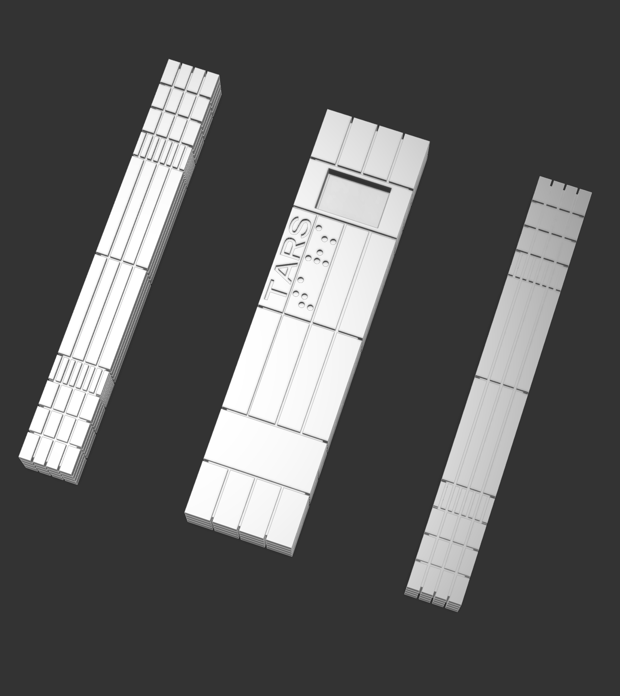

# TARS Quote

A miniature TARS with an OLED display that shows text that is sent to it via Firebase. 
A close friend of mine is a huge Interstellar fan, so I'm making this for her. 

### Features
- Show quote
	- From multiple people
	- Tracked with Firebase? I've used it before with ESP32 so should be straightforward
	- *Requires: ESP32, 0.96" OLED*
- Scroll if longer quotes
	- *Requires: EC11 rotary encoder (with button because why not)*

### Hardware

The TARS Quote device utilizes a three-part PCB. One part breaks out the USBC port so that it can be angled, a second is the main board with controls, and then the third board is a charlieplexed matrix of the TARS Braille dots.
The brains of this board is the ESP32S3-WROOM-1-N4. The display is a Waveshare SSD1331. The arms are moved by two standard blue 9g servos. Power and programming data come from USBC, and is stepped down using an AP2112K-3.3TRG. Standard 0805 LEDs and WS2818B LEDs compose the internal lighting of the system. Inputs come from a D-pad manufactured by Sparkfun. Speaker amplifier is a MAX98357A I2S IC. 

